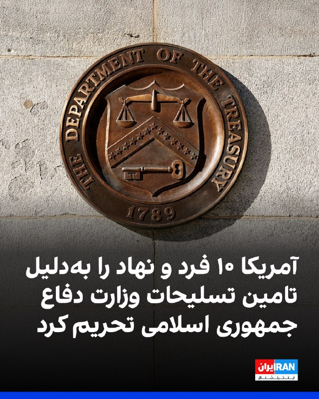

# 📡 بولتن تحلیلی اخبار و رسانه‌ها — 21:30 IRST (18:00 UTC)

**تاریخ انتشار:** `2026-09-29 21:30 IRST` | `2026-09-29 18:00 UTC`

> **سیستم پایش ۳۰ دقیقه‌ای بدون وقفه (Server 2 Ubuntu ARM64)**: جمع‌آوری کاملاً خودکار و مستقل از ۳۲ منبع خبری، کانال‌های تلگرام و حساب‌های توییتر بدون مصرف توکن LLM.

---

## توییتر و شبکه اکس (X / Twitter Intelligence)
*آخرین مواضع، بیانیه‌ها و توییت‌های حساب‌های منتخب بدون نیاز به توکن API*

*در این بازه ۳۰ دقیقه‌ای بروزرسانی جدیدی در این بخش ثبت نشد.*

## کانال‌های منتخب تلگرام (Telegram Monitoring)
*پایش لحظه‌ای پست‌ها، فایل‌ها و تحلیل‌های فنی از کانال‌های عمومی تلگرام*

- **`@IranintlTV (ایران اینترنشنال (تلگرام))`** [ویدیوی منتشرشده در رسانه‌های اجتماعی نشان می‌دهد مادر جاویدنام پرنیان دبیری با خودداری از ذکر نام یک مسئول حکومتی، خطاب ...](https://t.me/IranintlTV/359866) — `21:30 IRST` / `18:00 UTC`
  > ویدیوی منتشرشده در رسانه‌های اجتماعی نشان می‌دهد مادر جاویدنام پرنیان دبیری با خودداری از ذکر نام یک مسئول حکومتی، خطاب به او گفت: «آیا از اتفاقات ۱۸ و ۱۹ دی درکی دارید که مدرکی از شما بخواهیم؟»

این مادر دادخواه افزود: «همه آدمهای بیشعور مسئولیت کار خود را بر گردن دیگران می‌ا...

  
- **`@IranintlTV (ایران اینترنشنال (تلگرام))`** [وزارت خزانه‌داری آمریکا اعلام کرد در چارچوب عملیات «طرد اقتصادی»، ۱۰ فرد و نهاد را در کشورهای مختلف به‌دلیل مشارکت در تا...](https://t.me/IranintlTV/359865) — `21:21 IRST` / `17:51 UTC`
  > وزارت خزانه‌داری آمریکا اعلام کرد در چارچوب عملیات «طرد اقتصادی»، ۱۰ فرد و نهاد را در کشورهای مختلف به‌دلیل مشارکت در تامین تسلیحات و قطعات برای وزارت دفاع جمهوری اسلامی تحریم کرده است.
اسکات بسنت گفت وزارت خزانه‌داری هیچ‌گونه حمایتی از این حکومت را تحمل نخواهد کرد و به شناسای...

  

## اخبار و رسانه‌های فارسی (Persian News)
*مهم‌ترین تحولات ایران و منطقه از رسانه‌های معتبر و خبرگزاری‌های مستقل*

- **`رادیو فردا`** [وزارت خزانه‌داری آمریکا شبکه‌های تأمین تجهیزات نظامی ایران را هدف قرار داد](https://www.radiofarda.com/a/operation-economic-outcast-takes-down-iranian-military-procurement-networks/33866695.html) — `21:21 IRST` / `17:51 UTC`
  > وزارت خزانه‌داری آمریکا می‌گوید «سید اصغر علیزاده طباطبایی»، نماینده وزارت دفاع ایران در پکن، را نیز تحریم کرده است.

  
- **`ایران اینترنشنال`** [با وجود افزایش چشمگیر عبور نفت از تنگه هرمز، قیمت نفت مهار نشده است](https://www.iranintl.com/202609295526) — `21:05 IRST` / `17:35 UTC`
  > فایننشال‌تایمز با بررسی داده‌های بازار کالا و حمل‌ونقل دریایی گزارش داد صادرات نفت خاورمیانه، با وجود حملات پراکنده سپاه به کشتی‌های تجاری در تنگه هرمز به بالاترین سطح از آغاز جنگ ایران در نهم اسفند ۱۴۰۴ رسیده است اما این افزایش هنوز قیمت نفت را مهار نکرده است.

  
- **`دویچه‌وله فارسی`** [کولبری؛ چاره تحریم یا مرز معاش و مرگ](https://www.dw.com/fa-ir/کولبری؛-چاره-تحریم-یا-مرز-معاش-و-مرگ/a-79478238?maca=per-rss-per-all-1491-xml-mrss) — `20:52 IRST` / `17:22 UTC`
  > به گزارش سازمان تجارت توسعه تجارت، کولبری به مسیر ورود کالا تبدیل می‌شود؛ کولبران اما همچنان با فقر، خطر مرگ و نبود شغل پایدار روبه‌رو هستند.

## خبرگزاری‌های بین‌المللی (Global Wire)
*گزارش‌های فوری بین‌المللی از خبرگزاری‌های مادر (رویترز و اسوشیتد پرس)*

- **`Reuters Wire`** [Man City found guilty of all charges of financial rule breaches, Premier League confirms - Reuters](https://news.google.com/rss/articles/CBMiygFBVV95cUxQb0QzWWRSUWRHcU1jbzctM0hpVXc3UW1NbEFMejJWRHJhZmFMdmFZY3MwZ2Y2elluREM5ekd1RHF4SlFXemZKNHZUb2VTLXM4bFFJQWxPcURGVWxidk9ORmlaRGF0T0tURi1CQTV6QlZQU2lQM2kxVll4eUQxS2NGMm9tWENmcWcxTDVMcEE1ajVKa2ZrNUdBMUkyVTMySzN3aUlRbkR0OVpxZ3lwRzZTR095WDhCMzVRcmJzSHhRQk5CQmpnQlJsX253?oc=5) — `21:09 IRST` / `17:39 UTC`
  > Man City found guilty of all charges of financial rule breaches, Premier League confirms    Reuters
- **`Reuters Wire`** [Russia to cut welfare, education funding in 2027 as war spending soars - Reuters](https://news.google.com/rss/articles/CBMiqAFBVV95cUxQWUVoVnpYNzFMVk5lcmMxM1BfREoxTVhaTmcxU3ItcXZMRjVfU3FfSEtVZ0lTdmVTcmF2cDZyTkJWaGI1dHhzNnc2cU1PaktCaHc1WXJ6ZWswNVoteGp1ZDJfSHd2MFluTEI4WjJHNWRmRy1WV05Nd2U5c1JaNjZmZ2t4YlVoM2w4MXYyUkRZRHdYaTYyRE1vMk5vaUNNNmdpS1dNLVdmc2g?oc=5) — `20:03 IRST` / `16:33 UTC`
  > Russia to cut welfare, education funding in 2027 as war spending soars    Reuters
- **`Reuters Wire`** [Visa joins growing alarm over AI-powered risks - Reuters](https://news.google.com/rss/articles/CBMioAFBVV95cUxPRU5PVkVzbG1WV2hVMlBycDJnT2dXNFZVRkNmTzdlTGh6QXBla05FYWZsRDB5ZDljekx5aGF1ZkpFSEl4ZDdTcEpkT1ZUOGh6SkJOXzJRMkpBZkk1UzBXSmR2TmxKaEhaaHNmVGdXMHJnRjNMTG9zc2UtVTNXbnE3YW9TamJWQVd2UHlEUE1QVWpCd3NOdFE0ZmgySEpMdExv?oc=5) — `19:40 IRST` / `16:10 UTC`
  > Visa joins growing alarm over AI-powered risks    Reuters
- **`Reuters Wire`** [Czechs would be ready to respond to attack on Baltics, prime minister Babis says - Reuters](https://news.google.com/rss/articles/CBMisgFBVV95cUxPRkx0dUNjOS03NTVOOUliNnhGTEt4dnc2U0RfRklYa3NuU1d4MDVLdmlqUFJLREV4S1dNalJVWTRfbUJTN1FvcERuTG0xRWFqejBmaE82MTdDOGltYkxaLVcyd3kyYTNfVWNFeTFRc0FOZ3hIaWxCN3NSOXVESmY1VDhxMGQtMHJLdy1ZNkZlRFVPSDJUWGtSQ1VpSC1JNEVYWHFjTFBaeUtRMUtDbDZwYWV3?oc=5) — `18:59 IRST` / `15:29 UTC`
  > Czechs would be ready to respond to attack on Baltics, prime minister Babis says    Reuters

## فناوری و امنیت سایبری (Tech & Open Source)
*سرخط اخبار دنیای توسعه نرم‌افزار، امنیت و جامعه متن‌باز از Hacker News*

*در این بازه ۳۰ دقیقه‌ای بروزرسانی جدیدی در این بخش ثبت نشد.*

---
🔗 **دسترسی سریع:** [صفحه اصلی](../../index.md) | [آخرین اخبار (Latest)](../latest.md) | [داشبورد وب](../../public/index.html)
