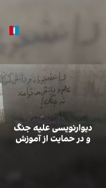

# ⚡ آخرین اخبار و رویدادهای لحظه‌ای (Latest Rolling News)

**آخرین همگام‌سازی پایپ‌لاین:** `2026-09-29 21:12 IRST` | `2026-09-29 17:42 UTC`

پایگاه خبری چندرسانه‌ای تاب‌آور. متن سبک و تصاویر محلی فشرده برای دسترسی حداکثر سرعت در شرایط اختلال اینترنت.

---

## توییتر و شبکه اکس (X / Twitter Intelligence)

- **`@MitraHejazipour (میترا حجازی‌پور)`** [The UK Foreign Secretary shook hands with a terrorist. 48 hours later, the same regime planned an attack on a U.S. base in the UK. Well played, moron! @Ed_Miliband](https://news.google.com/rss/articles/CBMiZ0FVX3lxTFBXQkY3VXJ6Z09qbVVtNllrUVplOGlDanNLRWp5eDVteEdmd1pGWXdwS2hSajc5MVZDYVRfSFVJZU50QU5fV0swQnpHRUpOQ3ZZSC0yMGtYY051bDVOMXZMbmdIdlRFWXM?oc=5) — `23:23 IRST` / `19:53 UTC`
  > The UK Foreign Secretary shook hands with a terrorist. 48 hours later, the same regime planned an attack on a U.S. base in the UK. Well played, moron! @Ed_Miliband    x.com
- **`@PahlaviComms (دفتر رسانه‌ای رضا پهلوی)`** [“The regime’s slogan is dialogue; but their guns are aimed at us.” Allameh University students in Tehran September 28, 2026](https://news.google.com/rss/articles/CBMiY0FVX3lxTE44ajN5bE5jcHJnN1VBN1JUSzZ1RHZzaDNfN0VNd1FGaEVlZHRuTGx3UnVLemxFZHdBSmxGdTBGZ2NtMTNVSy0tLXB5VzhmQ1dQTmpfbk1tNVhRaVJUeHNMVmgzbw?oc=5) — `18:07 IRST` / `14:37 UTC`
  > “The regime’s slogan is dialogue; but their guns are aimed at us.” Allameh University students in Tehran September 28, 2026    x.com
- **`@MatinSenPai (متین سنپای (فناوری و دور زدن))`** [https://t.co/tFKiZvrJ0L](https://news.google.com/rss/articles/CBMibEFVX3lxTE1rbExhQnlFQkV2WW1qTWRMenEtSktuTVIzdXZGcG1QTGV0aDZXWkNoY0NXcWZ6UHhMQ0JKUFAyM3VvRzFqaVFXVkgxOVlzV1ZYTUxpT0Q4YlNQLWFVSEZMZkVhSlAyTnhSUlU1Rg?oc=5) — `15:31 IRST` / `12:01 UTC`
  > https://t.co/tFKiZvrJ0L    x.com
- **`@realDonaldTrump`** [https://t.co/f9sRNhdkOb](https://news.google.com/rss/articles/CBMiZ0FVX3lxTE1MSk15aWpUTUdqZk1zR0VxRE8xaDNoa2JiNXJKUDA0SWNBRFdsdjVyemtTa01HUkZXbTNkeGRSTWo5U0FkVGtob3Vya1JZdEllUTY0dVpHYS1vZTV6dHktLVJUNERxdDQ?oc=5) — `07:25 IRST` / `03:55 UTC`
  > https://t.co/f9sRNhdkOb    x.com
- **`@realDonaldTrump`** [https://t.co/TipE4HtPhO](https://news.google.com/rss/articles/CBMiZ0FVX3lxTFB1bDFJb1RVX2ZaS2wzQWEwdE9DUURZSE44YW1fTUdGYnV3ZjRJRXVpQUFKRTdLdzNLclRSRUphRzROMEZiTkY1UGRtYUdBSUFYdm9vWTJaRkhXVVE3THh6TWpCRHdzSTg?oc=5) — `07:22 IRST` / `03:52 UTC`
  > https://t.co/TipE4HtPhO    x.com
- **`@realDonaldTrump`** [https://t.co/UyMXawLR3V](https://news.google.com/rss/articles/CBMiZ0FVX3lxTFBXcWViQXZPVTR0YW9xZmlBRkxVVkN1RVFQSDdMbmRsbERoZ3h0RlVSS3A2eXJRb1RqZUpsYno5TVpoSVJPemtNdlExeU9vSjlRa3VKNS1MME1fTkt4QmFaTm9Jc3NjRzg?oc=5) — `07:22 IRST` / `03:52 UTC`
  > https://t.co/UyMXawLR3V    x.com
- **`@souzangar (پوریا سوزنگر (امنیت و شبکه))`** [چه حال دلی چه غمی](https://news.google.com/rss/articles/CBMiX0FVX3lxTE5UVHZ1bWlUUUFmRFBIZWtMeTZpTHlhbGtaZExlbGp1Q0Myenp3X3R0bVZCaHZEWUlTUnV0VDBTYlhrM3BFZHJReEFQZ0ZHeG11WTRjTG5wUGFFYWt4N1pr?oc=5) — `23:10 IRST` / `19:40 UTC`
  > چه حال دلی چه غمی    x.com
- **`@realDonaldTrump`** [https://t.co/3iLzptOUWv](https://news.google.com/rss/articles/CBMiZ0FVX3lxTE9FUnhnRzFJbGdDUWVHbjBJUEdSLWgwYk4xNm10amhnSFBfaUI1Rnp0c2FnbUVaOWVjTGNka0xXWm5SNHFTWVhPUm9TV3JtdDdfYjJUaUlNb0hoaW1IVGF6WkMyX1lXemc?oc=5) — `05:09 IRST` / `01:39 UTC`
  > https://t.co/3iLzptOUWv    x.com
- **`@PahlaviComms (دفتر رسانه‌ای رضا پهلوی)`** [Slovenia’s principled stand at the United Nations sends a clear message: the Islamic Republic’s atrocities must not be met with silence. Prince Reza Pahlavi thanked Slovenia for standing with the Iranian people and looked ahead to friendship and alliance bet](https://news.google.com/rss/articles/CBMiY0FVX3lxTE1oWWxIWEczcHZ6Mm1mQ3BOODVpTjhScnpfTGNBVWZjM19mcEF6Y1lETHJrUkZnUU5Mbjh1SnkwZk1vaFY2a0xMOS05Mzc1VnhWbDJ4LTNpa0tKTUR2aVNCdmZEOA?oc=5) — `05:00 IRST` / `01:30 UTC`
  > Slovenia’s principled stand at the United Nations sends a clear message: the Islamic Republic’s atrocities must not be met with silence. Prince Reza Pahlavi thanked Slovenia for standing with the Iranian people and looked ahead to friendship and alliance bet    x.com
- **`@realDonaldTrump`** [https://t.co/XUMPtOIQYq](https://news.google.com/rss/articles/CBMiZ0FVX3lxTE13S1R0b3hCR3dlVXo4UWV2SHR3SGxGZUVHOU9xeG16N0I2NFdiaHpmNmNOU01oVkw5eEJZUmR0bjRHMVk0aW9IcFVKWHB4Q3h0ZjFMOEdLRXMzTFZBekhTcUFSMFNkQms?oc=5) — `04:54 IRST` / `01:24 UTC`
  > https://t.co/XUMPtOIQYq    x.com
- **`@tom_doerr`** [Installs over 750 open-source intelligence and security tools across 50 categories using single-command installers for Kali, Debian, Ubuntu, and Termux. https://t.co/svB2CzyjB9](https://news.google.com/rss/articles/CBMiakFVX3lxTE94aVcyRkJkdzRQOUtZaF9Iem82b3FJUDEzNUxHa1R5ZGFWZDFZOWJNVW5jZEVidjdwUkswblZFb3BJOFBqMlAyX09iNS1oWG5rZVZEQkgwWEd4ZHczaWVsWDRkZWw1aHN5d0E?oc=5) — `13:24 IRST` / `09:54 UTC`
  > Installs over 750 open-source intelligence and security tools across 50 categories using single-command installers for Kali, Debian, Ubuntu, and Termux. https://t.co/svB2CzyjB9    x.com
- **`@souzangar (پوریا سوزنگر (امنیت و شبکه))`** [BGP ipv6 link local unnumbered](https://news.google.com/rss/articles/CBMiX0FVX3lxTE5Kd1ZfZlk4ZFFfS0lJVUdXRUR5bVJZNzB2RHJoQ0JIY1lHODlBSGNmUFNWOHJ3eUtqcnFxVy1vSGE1VDlWMnFGdXNxSVBIMFJsNF91a3IxS1dZc1lxWnlR?oc=5) — `16:27 IRST` / `12:57 UTC`
  > BGP ipv6 link local unnumbered    x.com

## کانال‌های منتخب تلگرام (Telegram Monitoring)

- **`@IranintlTV (ایران اینترنشنال (تلگرام))`** [پلیس مبارزه با تروریسم بریتانیا سه‌شنبه هفتم مهر اعلام کرد در ادامه تحقیقات درباره طرح احتمالی حمله به پایگاه هوایی فرفو...](https://t.me/IranintlTV/359864) — `21:10 IRST` / `17:40 UTC`
  > پلیس مبارزه با تروریسم بریتانیا سه‌شنبه هفتم مهر اعلام کرد در ادامه تحقیقات درباره طرح احتمالی حمله به پایگاه هوایی فرفورد، چند ملک را در لندن بازرسی کرده است.

این تحقیقات پس از بازداشت پنج مرد در ارتباط با حادثه‌ای در نزدیکی این پایگاه آغاز شد.

پایگاه فرفورد در جریان جنگ ای...

  
- **`@IranintlTV (ایران اینترنشنال (تلگرام))`** [🔻 احسان حاج‌صفی، کاپیتان تیم ملی فوتبال ایران در دیدار برابر روسیه، با انجام صدمین و پنجاهمین بازی ملی، از جواد نکونام ب...](https://t.me/IranintlTV/359863) — `20:54 IRST` / `17:24 UTC`
  > 🔻 احسان حاج‌صفی، کاپیتان تیم ملی فوتبال ایران در دیدار برابر روسیه، با انجام صدمین و پنجاهمین بازی ملی، از جواد نکونام با ۱۴۹ بازی عبور کرد و به رکورددار بازی ملی در تاریخ فوتبال ایران تبدیل شد.

 🔹 حاج‌صفی که نخستین بازی ملی خود را در سال ۱۳۸۷ انجام داد، در چهار جام جهانی نیز...

  
- **`@Linuxor (لینوکسور (جامعه گنو/لینوکس))`** [یک مدل هوش مصنوعی مرموز، رایگان روی OpenRouter!](https://t.me/Linuxor/5491) — `20:44 IRST` / `17:14 UTC`
  > یک مدل هوش مصنوعی مرموز، رایگان روی OpenRouter!

با اسم عجیب Space Bunny معرفی شده؛ اما هنوز کسی دقیقاً نمی‌دونه چه مدلی پشت این اسم قرار گرفته.

چیزهایی که فعلاً ازش می‌دونیم:

کانتکست ۱ میلیون توکن
ورودی متن، تصویر و ویدئو
قابلیت تنظیم میزان Reasoning
پشتیبانی از Tool Callin...

  
- **`@IranintlTV (ایران اینترنشنال (تلگرام))`** [جاناتان سایح، تحلیلگر مسائل خاورمیانه در بنیاد دفاع از دموکراسی‌ها، با اشاره به سفر بنیامین نتانیاهو به امارات متحده عرب...](https://t.me/IranintlTV/359861) — `20:41 IRST` / `17:11 UTC`
  > جاناتان سایح، تحلیلگر مسائل خاورمیانه در بنیاد دفاع از دموکراسی‌ها، با اشاره به سفر بنیامین نتانیاهو به امارات متحده عربی گفت پیمان ابراهیم از مرحله عادی‌سازی روابط به همکاری امنیتی رسیده و امارات می‌تواند به‌عنوان پلی میان اسرائیل و دیگر کشورهای عربی عمل کند.

او افزود همکاری...

  
- **`@IranintlTV (ایران اینترنشنال (تلگرام))`** [بنیامین نتانیاهو، نخست‌وزیر اسرائیل، گفت نشانه‌هایی وجود دارد که دشمنان اسرائیل ممکن است پیش از انتخابات ماه آینده به ای...](https://t.me/IranintlTV/359860) — `20:37 IRST` / `17:07 UTC`
  > بنیامین نتانیاهو، نخست‌وزیر اسرائیل، گفت نشانه‌هایی وجود دارد که دشمنان اسرائیل ممکن است پیش از انتخابات ماه آینده به این کشور حمله کنند.

او بدون ارائه جزئیات هشدار داد: «با ما درنیفتید؛ نه حالا و نه هیچ‌وقت. دست ما هر جا و هر زمان که باشد، به شما خواهد رسید.»

هم‌زمان، منابع...

  
- **`@IranintlTV (ایران اینترنشنال (تلگرام))`** [مای ساتو، گزارشگر ویژه سازمان ملل، در واکنش به احکام اعدام صادرشده برای محسن اسلام‌خواه و شروین باقریان جبلی، دو معترض ب...](https://t.me/IranintlTV/359859) — `20:37 IRST` / `17:07 UTC`
  > مای ساتو، گزارشگر ویژه سازمان ملل، در واکنش به احکام اعدام صادرشده برای محسن اسلام‌خواه و شروین باقریان جبلی، دو معترض بازداشتی، در شبکه اجتماعی ایکس نوشت: «صدور حکم اعدام برای افرادی که هنگام وقوع «اقدامات ادعایی» کودک بوده‌اند، به‌طور کامل ممنوع است.»

او افزود: «رعایت ممنوع...

  
- **`@IranintlTV (ایران اینترنشنال (تلگرام))`** [ویدیوی ارسالی به ایران‌اینترنشنال نشان می‌دهد که در پیرانشهر استان آذربایجان غربی، شعار «دانشجویان و دانش‌آموزان علم و د...](https://t.me/IranintlTV/359858) — `20:33 IRST` / `17:03 UTC`
  > ویدیوی ارسالی به ایران‌اینترنشنال نشان می‌دهد که در پیرانشهر استان آذربایجان غربی، شعار «دانشجویان و دانش‌آموزان علم و دانش می‌خواهند، نه جنگ» روی دیوار یک خیابان نوشته شده است.

  
- **`@Linuxor (لینوکسور (جامعه گنو/لینوکس))`** [بعضی از دوستان وقتی چیزای سه بعدی به خصوص این بازیایی که با هوش مصنوعی ساخته شده رو روی کرومشون باز می‌کنن هنگ می‌کنه، ا...](https://t.me/Linuxor/5490) — `20:29 IRST` / `16:59 UTC`
  > بعضی از دوستان وقتی چیزای سه بعدی به خصوص این بازیایی که با هوش مصنوعی ساخته شده رو روی کرومشون باز می‌کنن هنگ می‌کنه، احتمالا مشکل از کانفیگ کارت گرافیکتون باشه

اول از اینجا چک کنید ببینید اصلا مرورگرتون به کارت گرافیکتون دسترسی داره (لینک رو کپی کنید توی کرومتون):
chrome://...

  
- **`@IranintlTV (ایران اینترنشنال (تلگرام))`** [جی‌دی ونس، معاون رییس‌جمهوری ایالات متحده، در مصاحبه با وینسنت کُگلیانیز، پادکست‌ساز و روزنامه‌نگار محافظه‌کار آمریکایی،...](https://t.me/IranintlTV/359857) — `20:21 IRST` / `16:51 UTC`
  > جی‌دی ونس، معاون رییس‌جمهوری ایالات متحده، در مصاحبه با وینسنت کُگلیانیز، پادکست‌ساز و روزنامه‌نگار محافظه‌کار آمریکایی، ساختار قدرت در ایران را «بسیار گیج‌کننده» توصیف کرد.

ونس گفت: «تندروها، محافظه‌کاران، میانه‌روها و روحانیون حضور دارند و همه این گروه‌ها در فرایند تصمیم‌گی...

  
- **`@Linuxor (لینوکسور (جامعه گنو/لینوکس))`** [این مدل هم دیروز ورژن جدیدش معرفی شده برای ساخت ویدیو های معرفی محصول خیلی خوبه، با InSpatio-World 1.5 می‌تونی یک عکس، چ...](https://t.me/Linuxor/5489) — `20:14 IRST` / `16:44 UTC`
  > این مدل هم دیروز ورژن جدیدش معرفی شده برای ساخت ویدیو های معرفی محصول خیلی خوبه، با InSpatio-World 1.5 می‌تونی یک عکس، چند عکس، تصویر پانوراما یا حتی ویدیو رو به یک دنیای 4 بعدی پویا و قابل کاوش تبدیل کنی و دوربین رو توش بچرخونی!

تست آنلاین:
 world.inspatio.com 

کد هاش:

 in...

  
- **`@whitedns (وایت دی‌ان‌اس (DNS و ضدسانسور))`** [🎀 بچه‌هااا یه آموزش خفن و کاربردی جدید دارم براتون! 🥹 💗](https://t.me/whitedns/1881) — `20:09 IRST` / `16:39 UTC`
  > 🎀 بچه‌هااا یه آموزش خفن و کاربردی جدید دارم براتون! 🥹 💗 

می‌خواین هاست رایگان بسازین و ازش کانفیگ V2Ray رایگان بگیرین؟ 👀 ✨ 

توی این ویدیو با Blue Knight Panel همه‌چیز رو از صفر باهم ساختیم و آخرش هم کانفیگ رو تست کردیم 😍 🔥 

اگه این چیزا برات جالبه، حتماً یه سر به ویدیو بزن؛...
- **`@IranintlTV (ایران اینترنشنال (تلگرام))`** [تیتر اول با نیوشا صارمی، سه‌شنبه ۷ مهر](https://t.me/IranintlTV/359856) — `20:08 IRST` / `16:38 UTC`
  > تیتر اول با نیوشا صارمی، سه‌شنبه ۷ مهر
 @iranintltv
- **`@IranintlTV (ایران اینترنشنال (تلگرام))`** [محمد اکرمی‌نیا، سخنگوی ارتش جمهوری اسلامی، سه‌شنبه هفتم مهر در سخنانی گفت در جنگ راهبرد نظامی «از پدافند به آفند» عملیات...](https://t.me/IranintlTV/359855) — `20:05 IRST` / `16:35 UTC`
  > محمد اکرمی‌نیا، سخنگوی ارتش جمهوری اسلامی، سه‌شنبه هفتم مهر در سخنانی گفت در جنگ راهبرد نظامی «از پدافند به آفند» عملیاتی شده است و این در واقع نوعی جنگ پیش‌دستانه محسوب می‌شود.

سخنگوی ارتش افزود: «قبل از اینکه دشمن دست به تعرضی بزند، مورد هدف قرار گرفته و در آینده نیز به همی...
- **`@IranintlTV (ایران اینترنشنال (تلگرام))`** [ویدیوی منتشرشده در رسانه‌های اجتماعی دیده شدن یک پلنگ ایرانی را در کجور استان مازندران نشان می‌دهد.](https://t.me/IranintlTV/359854) — `20:02 IRST` / `16:32 UTC`
- **`@Linuxor (لینوکسور (جامعه گنو/لینوکس))`** [📱 خرید اقساطی و مطمئن اشتراک و اکانت‌های محبوب با بهترین قیمت در ساب‌مارت!](https://t.me/Linuxor/5488) — `19:59 IRST` / `16:29 UTC`
  > 📱 خرید اقساطی و مطمئن اشتراک و اکانت‌های محبوب با بهترین قیمت در ساب‌مارت!

 🤖 ChatGPT | 🤖 Claude | 🤖 Gemini 
 🤖 Cursor | 🤖 Grok | 📹 KlingAI 

 🤖 جمنای پرو 1 ماهه 
 فقط 299 هزار تومان 

 🛒 تلگرام پریمیوم، کپ‌کات، دولینگو و کلی سرویس دیگه... 

 💳 امکان پرداخت 4 قسطه با اسنپ‌پی ...

## اخبار و رسانه‌های فارسی (Persian News)

- **`بی‌بی‌سی فارسی`** [قیمت دلار در بازار آزاد ایران از ۲۵۰ هزار تومان گذشت](https://www.bbc.co.uk/persian/live/cq0lrdlp2lgnt?at_medium=RSS&at_campaign=rss) — `21:12 IRST` / `17:42 UTC`
  > نرخ دلار در معاملات امروز بازار آزاد ایران با ثبت یک رکورد تازه از ۲۵۰ هزار تومان گذشت. در همین حال محمدباقر قالیباف به آمریکا و «سایر کشورها» هشدار داد «در منطقه‌ای که ما نفت نفروشیم، کسی نفت نخواهد فروخت و اگر امنیت ما تامین نشود، هیچ زیرساختی ایمن نخواهد بود.» دونالد ترامپ ...

  
- **`یورونیوز فارسی`** [چراغ سبز آمریکا به پروازهای زیارتی بین ایران و نجف؛ از محدودیت‌های مسافران چه می‌دانیم؟](https://parsi.euronews.com/2026/09/29/us-green-light-for-pilgrimage-flights-between-iran-and-najaf) — `21:02 IRST` / `17:32 UTC`
  > وزارت حمل‌ونقل عراق روز سه‌شنبه ۲۹ سپتامبر (هفتم مهر ۱۴۰۵) اعلام کرد که شرکت هواپیمایی عراق در حال آماده شدن برای ازسرگیری پروازهای خود به ایران در ماه اکتبر است.
- **`ایران اینترنشنال`** [با حضور در بازی با روسیه؛ احسان حاج‌صفی رکورددار بازی ملی شد](https://www.iranintl.com/202609296600) — `20:44 IRST` / `17:14 UTC`
  > احسان حاج‌صفی، کاپیتان تیم ملی فوتبال ایران در دیدار برابر روسیه، با انجام صدمین و پنجاهمین بازی ملی، از جواد نکونام با ۱۴۹ بازی عبور کرد و به رکورددار بازی ملی در تاریخ فوتبال ایران تبدیل شد.

  
- **`ایران اینترنشنال`** [بدن به مثابه میدان نبرد در مبارزه ایران؛ تتو در برابر گلوله](https://exclusive.iranintl.com/tattoo-iran-protests) — `20:25 IRST` / `16:55 UTC`
  > پس از آن‌که جمهوری اسلامی در جریان خیزش سراسری دی‌ماه ۱۴۰۴ در ایران به سوی معترضان آتش گشود و خیابان‌ها، بیمارستان‌ها و سردخانه‌ها را از مجروحان و کشته‌شدگان پر کرد، شاید توانست خیابان‌ها را خاموش کند، اما اعتراض و مخالفت میدان نبرد تازه‌ای یافته است: بدن.

  
- **`ایران اینترنشنال`** [زلزله در فوتبال انگلیس؛ منچسترسیتی به تخلفات مالی ۹۰۰ میلیون پوندی محکوم شد](https://www.iranintl.com/202609292105) — `20:21 IRST` / `16:51 UTC`
  > کمیسیون مستقل رسیدگی به پرونده بیش از ۱۰۰ اتهام مطرح‌شده از سوی لیگ برتر انگلیس علیه منچسترسیتی، این باشگاه را در بیشتر اتهامات، از جمله جدی‌ترین تخلفات مالی، گناهکار شناخت.

  
- **`یورونیوز فارسی`** [هشدار نتانیاهو درباره حمله پیش از انتخابات؛ پیام به ایران یا تلاش برای حفظ قدرت؟](https://parsi.euronews.com/2026/09/29/netanyahus-warning-about-pre-election-attack-a-message-to-iran-or-to-maintain-power) — `20:15 IRST` / `16:45 UTC`
  > بنیامین نتانیاهو، نخست‌وزیر اسرائیل، روز سه‌شنبه، چهار هفته مانده به انتخابات، در ویدیویی که در یک پایگاه هوایی نظامی ضبط شده، گفته نشانه‌هایی وجود دارد که دشمنان اسرائیل برای حمله پیش از رای‌گیری برنامه‌ریزی می‌کنند.
- **`یورونیوز فارسی`** [شرکت اسپانیایی ساتلیوت با اسپیس ایکس پنج ماهواره برای تقویت ۵جی جهانی پرتاب می‌کند](https://parsi.euronews.com/2026/09/29/sateliot-will-launch-5-new-satellites-with-spacex-to-expand-the-coverage-of-the-5g-network) — `19:51 IRST` / `16:21 UTC`
  > شرکت ساتلیوت روز پنجشنبه با همکاری اسپیس‌ایکس پنج ماهواره جدید پرتاب می‌کند و صورت‌فلکی خود را به ۱۱ ماهواره می‌رساند. ماموریت «دراکونیس» عبورهای روزانه را دو برابر و زمان بازدید مجدد را نصف کرده و خدمات اتصال اینترنت اشیا از طریق ۵جی NTN را تقویت می‌کند.
- **`یورونیوز فارسی`** [نشست سفر و گردشگری یورونیوز ۲۰۲۶: پنج نکته کلیدی و مهم](https://parsi.euronews.com/2026/09/29/euronews-travel-tourism-summit-2026-five-of-the-key-takeaways) — `19:42 IRST` / `16:12 UTC`
  > شخصیت‌های برجسته صنعت سفر ۲۹ سپتامبر در بروکسل به یورونیوز پیوستند. در این گزارش مهم‌ترین نکاتی را که باید بدانید مرور می‌کنیم.
- **`یورونیوز فارسی`** [نشست سفر و گردشگری یورونیوز ۲۰۲۶؛ تماشای دوباره ویدیو](https://parsi.euronews.com/2026/09/29/euronews-travel-tourism-summit-2026-watch-live-today-from-brussels) — `19:40 IRST` / `16:10 UTC`
  > نشست سفر و گردشگری یورونیوز ۲۰۲۶ در بروکسل، رهبران سیاسی، سیاست‌گذاران و کارشناسان صنعت را گرد هم آورد تا درباره مهم‌ترین مسائل شکل‌دهنده آینده سفر بحث کنند.
- **`یورونیوز فارسی`** [سقوط بی‌سابقه ارزش پول ایران؛ نرخ برابری دلار به بیش از ۲۵۰ هزار تومان رسید](https://parsi.euronews.com/2026/09/29/unprecedented-fall-in-the-value-of-iran-currency-dollar-reached-more-than-25k-tomans) — `19:38 IRST` / `16:08 UTC`
  > ارزش پول ملی ایران روز سه‌شنبه ۷ مهر ۱۴۰۵ (۲۹ سپتامبر) به پایین‌ترین سطح تاریخی خود سقوط کرد و معامله‌گران در تهران هر دلار آمریکا را بیش از ۲٫۵ میلیون ریال دادوستد کردند؛ امری که بازتابی آشکار از فرسایش و تضعیف مداوم اقتصاد ایران در میانه جنگ است.
- **`یورونیوز فارسی`** [اعتصاب دانش‌آموزان فرانسوی در مدارس سراسر کشور برای منابع بیشتر](https://parsi.euronews.com/video/2026/09/29/french-students-blockade-schools-nationwide-to-demand-more-resources) — `19:37 IRST` / `16:07 UTC`
  > صدها دانش‌آموز دبیرستانی در رن و پاریس در جریان روز ملی اعتراض، با مسدود کردن ورودی مدارس، خواستار افزایش نیرو و بودجه بیشتر برای آموزش شدند.
- **`یورونیوز فارسی`** [همایش امنیت باکو تهدیدهای فرامرزی را در کانون توجه قرار می‌دهد](https://parsi.euronews.com/2026/09/29/baku-security-forum-focuses-on-cross-border-threats) — `19:30 IRST` / `16:00 UTC`
  > مجمع امنیتی باکو مسئولان امنیتی و اطلاعاتی کشورهای مختلف را برای بررسی مبارزه با تروریسم، تهدیدهای نوظهور و تقویت همکاری بین‌المللی گردهم آورد.
- **`یورونیوز فارسی`** [مجله خبری| ۷ مهر ۱۴۰۵ (۲۹ سپتامبر ۲۰۲۶) - شامگاهی](https://parsi.euronews.com/video/2026/09/29/mglh-khbri-mhr-sptambr-shamgahi) — `19:30 IRST` / `16:00 UTC`
  > آخرین تحولات اروپا و جهان را دنبال کنید ۷ مهر ۱۴۰۵ (۲۹ سپتامبر ۲۰۲۶). با یورونیوز در جریان آخرین اخبار و رویدادهای سیاسی، اقتصادی، فرهنگی و سرگرمی قرار بگیرید.
- **`ایران اینترنشنال`** [حکومت کمک‌ مالی خانواده‌ای را پس از کشته‌شدن فرزندش در اعتراضات قطع کرد](https://www.iranintl.com/202609295946) — `19:30 IRST` / `16:00 UTC`
  > گزارش‌های رسیده به ایران‌اینترنشنال حاکی از آن است که مقام‌های جمهوری اسلامی کمک‌های دولتی قانونی به یک خانواده را به دلیل آن‌که فرزندشان در اعتراضات دی‌ماه ۱۴۰۴ کشته شد، قطع کرده است.
- **`یورونیوز فارسی`** [AMD ۸.۲ میلیارد دلار روی «مادرخوانده هوش مصنوعی» و دنیاهای مجازی‌اش سرمایه‌گذاری می‌کند](https://parsi.euronews.com/2026/09/29/nvidia-rival-amd-bets-82bn-on-the-godmother-of-ai-and-her-virtual-worlds) — `19:10 IRST` / `15:40 UTC`
  > ورلد لبز مدل‌های جهان را توسعه می‌دهد؛ سامانه‌های هوش مصنوعی‌ای که رفتار اشیا و فضاها را درک کرده و امکان شبیه‌سازی پیامد حرکت یا هر کنش را فراهم می‌کنند.
- **`ایران اینترنشنال`** [آمریکا درباره گسترش همکاری حوثی‌های یمن و الشباب سومالی هشدار داد](https://www.iranintl.com/202609297424) — `18:52 IRST` / `15:22 UTC`
  > فایننشال‌تایمز گزارش داد گسترش همکاری حوثی‌های مورد حمایت تهران با الشباب، شاخه القاعده در سومالی، به این گروه یمنی امکان می‌دهد در دو سوی خلیج عدن جای پا پیدا کند. مقام‌های آمریکایی این روابط را تهدیدی «تنش‌زا» برای ثبات منطقه و مسیرهای حیاتی کشتیرانی می‌دانند.
- **`رادیو فردا`** [ازسرگیری پروازهای عراق به ایران از ماه اکتبر؛ آمریکا شرایط سختگیرانه‌ای تعیین کرد](https://www.radiofarda.com/a/iraqi-airways-to-resume-iran-flights-after-securing-special-exemption-us/33866621.html) — `18:33 IRST` / `15:03 UTC`
  > بر اساس مجوز وزارت خزانه‌داری آمریکا، انتقال وجوه پول نقد زیاد از سوی مسافران ممنوع شده و افراد تحت تحریم ایالات متحده نیز نمی‌توانند از این پروازها استفاده کنند.
- **`دویچه‌وله فارسی`** [آمار رسمی؛ وابستگی محسوس بازار کار آلمان به مهاجران](https://www.dw.com/fa-ir/آمار-رسمی؛-وابستگی-محسوس-بازار-کار-آلمان-به-مهاجران/a-79476830?maca=per-rss-per-all-1491-xml-mrss) — `18:18 IRST` / `14:48 UTC`
  > ارزیابی جدید اداره آمار آلمان نشان می‌دهد که بدون نیروی کار افراد با پیشینه مهاجرتی، عملاً هیچ کاری در آلمان پیش نمی‌رود. در بسیاری از مشاغل دارای کمبود نیروی متخصص، افراد دارای پیشینه مهاجرتی اکثریت را تشکیل می‌دهند.
- **`دویچه‌وله فارسی`** [کرملین: ایران در پیمان منع گسترش هسته‌ای بماند](https://www.dw.com/fa-ir/کرملین-ایران-در-پیمان-منع-گسترش-هسته‌ای-بماند/live-79468063?maca=per-rss-per-all-1491-xml-mrss) — `17:44 IRST` / `14:14 UTC`
  > به گفته سخنگوی کرملین مسکو امیدوار است ایران همچنان "عضوی مهم و مسئول" در پیمان منع گسترش سلاح‌های هسته‌ای باقی بماند. این اظهارات در واکنش به طرح مجلس ایران برای خروج از ان پی تی عنوان شده است.
- **`دویچه‌وله فارسی`** [فشار بر حزب چپ آلمان؛ تهدید به قطع حمایت مالی از برلین](https://www.dw.com/fa-ir/فشار-بر-حزب-چپ-آلمان؛-تهدید-به-قطع-حمایت-مالی-از-برلین/a-79474731?maca=per-rss-per-all-1491-xml-mrss) — `16:57 IRST` / `13:27 UTC`
  > پیروزی حزب چپ، احتمال تشکیل نخستین دولت ایالتی برلین به رهبری این حزب را افزایش داده است. حال ایالت‌های تحت حاکمیت احزاب متحد مسیحی برلین را، در صورت تشکیل دولتی ایالتی به رهبری حزب چپ، به پیامدهای مالی تهدید کرده‌اند.

## خبرگزاری‌های بین‌المللی (Global Wire)

- **`Reuters Wire`** [Morocco's king appoints first woman prime minister following election - Reuters](https://news.google.com/rss/articles/CBMiswFBVV95cUxOUW1pZ1hkUzRiU3k3UTFjenJBS1FDSHhDV21HbUJKc1dHVjJaeEFKT3d0SEI4VGtxVVVma2gzbkgtRFdtRnRtLWZGdUs2LS12X1JWQ0lpUTBuVXhYbDdNS3hpWTFfZzJXdnl6d2RObXRfS0JLb2t5T3p5RGNCZ212OUg0bUZWYnBvVVh2bF9XZkJkcWRVTXRxN1hZa3RPenNwWmQ0R19CUDlaVFBfMXFmamVWNA?oc=5) — `20:52 IRST` / `17:22 UTC`
  > Morocco's king appoints first woman prime minister following election    Reuters
- **`Reuters Wire`** [FBI official tells hackers to get in touch, says 'we know how to find you' - Reuters](https://news.google.com/rss/articles/CBMivgFBVV95cUxPbkZjdWk2eHpHMEpNQnlDZmo2OFlJOE5OeEgxTm9nWFBfbjRPeFBSQWhqcUhxNWpKR0p1ZFZuVlhvS3NGd3NtTFQ1bmtOM09oQTFManZxdWJ3OUlmUVB1YVJyMzhybW5KbzdVZ3JzeXc1enJNbXJuRk5kN0hzel9nMzNVQ3JwSlVNVk85cjJLRmdoRmtQVHZ3S3FiX3NCU3J2Ny1qaTVYWDlOVG5XcEZJVHA3aXlBWVRMWHJqUGhn?oc=5) — `20:10 IRST` / `16:40 UTC`
  > FBI official tells hackers to get in touch, says 'we know how to find you'    Reuters
- **`Reuters Wire`** [Apple's Ternus eyes engineering-led overhaul, Bloomberg News reports - Reuters](https://news.google.com/rss/articles/CBMiwwFBVV95cUxPVS1iZU1pQXkzLXgxVDY2UVRGRUUtQTROZkFDbDFDZWgyalpCczN6U3F5Wm9rVmJqSlVQbVJGNkN2WVEwVEZEQ3VFWmlqNmpUSmZxSGtDU25LdUlVUWhXem9HYWI3V3N0c2wtRDVlSmpZVlVWWF9SMVAxbnMyYUY3ckFKakI1NnUtdk1JY1EyaTFFNTBUSUZmZU04S1ozNGlnYWh3cWpXQkpCdGI4ZFJrN09HS3FfODZjZGVDa3JzR20zRWs?oc=5) — `19:47 IRST` / `16:17 UTC`
  > Apple's Ternus eyes engineering-led overhaul, Bloomberg News reports    Reuters
- **`Reuters Wire`** [Netlist seeks U.S. import ban on Micron chips used in Google, Nvidia AI computing - Reuters](https://news.google.com/rss/articles/CBMiwwFBVV95cUxQSmxnMEM4VmZvZUtSUTFlQWI0bWIyRFJmMEh4RTh5ck5obV85T2RMeTJoU1VLN3BwRkE4d3F4ZjNiaDN1RzNtVDczTGNPQnF0ZzIyUnNzSk40TnhaZXZNRmVyUUZ5cjZXUGtWR0puZHZSejFnQkthMHJfQkhxMEZVTWgxVTBQeUJxM3RlaXBKcXB4RDZIOFU3SExnR3lHcUN3dUdlUHhPZ25SN0xPMEJGcnc4d0d5VkwwUmxaMlQ0blZqcU0?oc=5) — `19:20 IRST` / `15:50 UTC`
  > Netlist seeks U.S. import ban on Micron chips used in Google, Nvidia AI computing    Reuters
- **`AP News Wire`** [Andy Burnham pledges a big shakeup for Britain in a high-risk political speech - AP News](https://news.google.com/rss/articles/CBMingFBVV95cUxNRVpBdHdzY0N3SGhTZGQ3bkEtUHk5MWpaRmNjV1pDdUcxazJDZU1LS0RCNDUwT282Y0tKa2YyaGsxcXpfbnpldGVkQk9DbDNMT282c2Z6QWhGNjBQNUNwd25CX083TG5vN19mbEZmSUM3SEJJWkNZYUpTT21xV3RITWZlZTllTGNTRW1ZNFFpUV9ObUN1MzUxdXUtZHhXZw?oc=5) — `19:10 IRST` / `15:40 UTC`
  > Andy Burnham pledges a big shakeup for Britain in a high-risk political speech    AP News
- **`Reuters Wire`** [Spotify, Anthropic's Claude down for some US users, Downdetector shows - Reuters](https://news.google.com/rss/articles/CBMimwFBVV95cUxNZUZGeHhCUUctV3ZXZmpFV1NheVhYbFZYZkRPNjY0SWpRMFZGVjg1Zk9HYjRUM2NtRVc0SlVZbE00a1RDT283S1h4NGp3dFlkWUlDMzJKQmZldl9pY2VKejhhaFJBQUk0VGR1NTRoN2tJZ19PaFNoVEJvd3RwTkNoVUNidXM1VGVzTDUwcDQ4MDk0YklLdm5Ia1Bmbw?oc=5) — `18:15 IRST` / `14:45 UTC`
  > Spotify, Anthropic's Claude down for some US users, Downdetector shows    Reuters
- **`Reuters Wire`** ['Let them be scared': Moscow sends EU message with widening corporate crackdown - Reuters](https://news.google.com/rss/articles/CBMiwwFBVV95cUxOeUpiNFhHVVZjSFowMlNkRHE5WW85cFhCM3FPYU1tTFlPZ3Z4bDVtN1VGU1JXUmFJcFpQY1V2R19LUkRCa2VXTWl0SFBVWmp0SFIwN21KNTR6NnNzQWl0eW54SkpFTkU0TkdxXzNfa3Q1ekZBTWUyenFWMFgwdjd3SlhiNnNGUnN0ZVRGRDh1eTY2V2VUbkNDNFhjYndLb2hORzdTWXpxMDBnMk1NRjZMRFV6dlF4YzlOQnl2OHZGaWN0Q2c?oc=5) — `17:39 IRST` / `14:09 UTC`
  > 'Let them be scared': Moscow sends EU message with widening corporate crackdown    Reuters
- **`Reuters Wire`** [Spain plans stricter rules on asylum seekers in Ceuta, draft decree shows - Reuters](https://news.google.com/rss/articles/CBMitgFBVV95cUxQMlJUNGlxc3d5eG44QWducTBxOWZ3UjRtTWFIZm95WkY5NWc5OEl6NTV5RGc1SDBRLWEwNmpqelVhUi01TTU4aHVQajJkUFlVZTE1VW1INWU3Y19yWlktbDRzbkg2T29LYkdDNG1ZYnBGaGdWZXhqZnJJNzd6SS12SElzY3lKVktUMkF0YjlnYnpNdVVTUU9TdzhCUGhEZEhMc2VTNEFnLV9qTlVPZTVWZkpUS0FKQQ?oc=5) — `17:28 IRST` / `13:58 UTC`
  > Spain plans stricter rules on asylum seekers in Ceuta, draft decree shows    Reuters
- **`Reuters Wire`** [AT&T signs over $3 billion fiber deal with Corning as data demand surges - Reuters](https://news.google.com/rss/articles/CBMixAFBVV95cUxQLTFBWVFQaDBka0NCQzJEb3Q1STFOQy1pSDFYTVhBaWt5Y3NGa0xiUGpYNDlES0xFdFN5S2ZBa3l2WFgxc2NxQk5DUkZaSFdVSGpDZkx5a0Jqc24tMGkxRURkSURrZGRnNVRZdjhkM3NhY3FiOFVvc2tVUnpWWXJXTTd1dzFac3NObDE4TWQ2RVpvZ0Q4VVFJVlBtRDFlMjdkX1lXal9fVF9TUF95bXg5RjdUNGpFdk1rRV9WQWNVUGFiTFdx?oc=5) — `17:01 IRST` / `13:31 UTC`
  > AT&T signs over $3 billion fiber deal with Corning as data demand surges    Reuters
- **`Reuters Wire`** [China opens rare joint military support centre in Laos - Reuters](https://news.google.com/rss/articles/CBMiqgFBVV95cUxNRWF6MFFMYXZfSUVHb2h1NlIxcHB4ckJ1dWZXcGNOdzc2OG1tSXZLMlR5MkZPUGRQbHhhTlpnX2U0YjNtelgzMWt1aEdZcVEtcFVwYVI3TEFhck9ZeDZDbnpmUExlMHFvWG1Jb0ZHRW5EMk9fYzNZSTBHUXNHRmd6d2ZPamZrTkNrNVlIcG1Ebk44cHRWSnBFajVLOXo2V2xjSFdKRkJfUF9IQQ?oc=5) — `16:42 IRST` / `13:12 UTC`
  > China opens rare joint military support centre in Laos    Reuters
- **`Reuters Wire`** [China unveils rate cut, mortgage subsidies to spur growth - Reuters](https://news.google.com/rss/articles/CBMirAFBVV95cUxQSGZMSndvRHFuSzN1ZnJCbHNuYmlzalpvVTc3Y3JTU3lCYjc4X1I1VHdnVmQzUUV4M2JwSEdvMGF3TnFFTVp1NHFaTkJ3a01XY1lSWTNkaVRhZHBDajZkN1VZOGEyN3lsT3JiV1BibE9wSG5taEZPUjVLR0djeTJGcGtORWYtd1FZaUZMQ215RkhLekVDUkJ1U3BEQ3BmTWc5TF9ubUZoNXNWRGFa?oc=5) — `15:57 IRST` / `12:27 UTC`
  > China unveils rate cut, mortgage subsidies to spur growth    Reuters
- **`AP News Wire`** [Teacher killed in student attack at an elementary school in Slovakia, 2 others injured - AP News](https://news.google.com/rss/articles/CBMingFBVV95cUxQNXNFdDlwcGlISTlZM1FGdU13SElRZWhRMzVzazVxYVJmVjVTOVFFTHhRTjlxOEtTZ25XdGllV3BKZnFiZmRtdDNXQ2FQTGJ3WEt4a2FiLXA2d2poU3RPMjBBV2c4QWZSTHZVX3RjX0VHd2VzOXotV0dmUzlGRXc2dmlvaFc5NnBybHRVbjd2Q0pDUHFKRUp3UTc5eVJ0Zw?oc=5) — `15:29 IRST` / `11:59 UTC`
  > Teacher killed in student attack at an elementary school in Slovakia, 2 others injured    AP News

## فناوری و امنیت سایبری (Tech & Open Source)

- **`Hacker News`** [Tcl/Tk 9.1 Released](https://www.tcl-lang.org/software/tcltk/9.1.html) — `20:43 IRST` / `17:13 UTC`
  > Article URL: https://www.tcl-lang.org/software/tcltk/9.1.html 
 Comments URL: https://news.ycombinator.com/item?id=49896712 
 Points: 3 
 # Comments: 0
- **`Hacker News`** [Dots](https://openai.com/index/introducing-dots/) — `20:37 IRST` / `17:07 UTC`
  > Article URL: https://openai.com/index/introducing-dots/ 
 Comments URL: https://news.ycombinator.com/item?id=49896604 
 Points: 91 
 # Comments: 41
- **`Hacker News`** [GPT 6.1 Sol](https://openai.com/index/introducing-gpt-6-1-sol/) — `20:36 IRST` / `17:06 UTC`
  > Article URL: https://openai.com/index/introducing-gpt-6-1-sol/ 
 Comments URL: https://news.ycombinator.com/item?id=49896586 
 Points: 161 
 # Comments: 79
- **`Hacker News`** [DraftKings Is Using AI to Behaviorally Target Chronic Gamblers](https://www.eff.org/deeplinks/2026/09/draftkings-using-ai-supercharge-harms-online-behavioral-advertising) — `20:00 IRST` / `16:30 UTC`
  > Article URL: https://www.eff.org/deeplinks/2026/09/draftkings-using-ai-supercharge-harms-online-behavioral-advertising 
 Comments URL: https://news.ycombinator.com/item?id=49896050 
 Points: 103 
 # Comments: 57
- **`Hacker News`** [Show HN: NSL – WSL for Linux](https://frostyard.github.io/nsl/) — `18:21 IRST` / `14:51 UTC`
  > One of the things that Windows really got right is WSL2. I drive an atomic Linux distro for daily use, but wanted a way to develop with multiple different distros with that same WSL UX. NSL is my answer. It is a faithful reproduction of the developer experience, powered by a s...
- **`Hacker News`** [macOS Golden Gate Is a Buggy Mess](https://www.squareorbits.com/blog/2026/09/macos-golden-gate-is-a-buggy-mess/) — `18:02 IRST` / `14:32 UTC`
  > Article URL: https://www.squareorbits.com/blog/2026/09/macos-golden-gate-is-a-buggy-mess/ 
 Comments URL: https://news.ycombinator.com/item?id=49894005 
 Points: 314 
 # Comments: 219
- **`Hacker News`** [Google ending ChromeOS support two years early](https://www.theregister.com/os-platforms/2026/09/29/google-ending-chromeos-support-two-years-early/5299674) — `17:42 IRST` / `14:12 UTC`
  > Article URL: https://www.theregister.com/os-platforms/2026/09/29/google-ending-chromeos-support-two-years-early/5299674 
 Comments URL: https://news.ycombinator.com/item?id=49893653 
 Points: 107 
 # Comments: 80
- **`Hacker News`** [How Delhi cut electricity loss from 50 to 5 percent](https://spectrum.ieee.org/delhi-electricity-loss) — `16:13 IRST` / `12:43 UTC`
  > Article URL: https://spectrum.ieee.org/delhi-electricity-loss 
 Comments URL: https://news.ycombinator.com/item?id=49892245 
 Points: 301 
 # Comments: 175
- **`Hacker News`** [Without the Hot Air](https://www.withouthotair.com/) — `16:08 IRST` / `12:38 UTC`
  > Article URL: https://www.withouthotair.com/ 
 Comments URL: https://news.ycombinator.com/item?id=49892175 
 Points: 95 
 # Comments: 47
- **`Hacker News`** [1 in 8 cancer cases worldwide are caused by infections, study finds](https://www.cbc.ca/lite/story/9.7361622) — `16:03 IRST` / `12:33 UTC`
  > Article URL: https://www.cbc.ca/lite/story/9.7361622 
 Comments URL: https://news.ycombinator.com/item?id=49892120 
 Points: 141 
 # Comments: 88

---
📂 [آرشیو ۳۰ دقیقه‌ای اخبار](../index.md) | 🌐 [مشاهده نسخه تحت وب سبک](../public/index.html)
